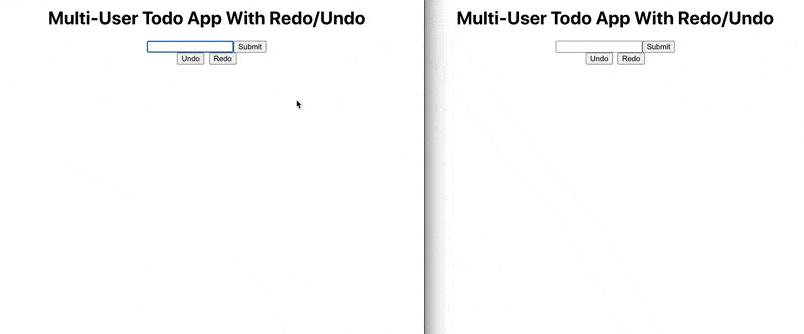

# Multi User Todo With Undo/Redo

## About

A todo app that syncs adding,deleting and filtering todos across multiple sessions with undo and redo functionality and is persistent to new connections.



---

## Getting Started

These instructions will get you a copy of the project up and running on your local machine.

---

## Prerequisites

- Node.js
- Free port 8000

---

## Instructions

### 1. Clone this git repository

```
git clone https://github.com/syncstate/multi-user-todo-undo-redo-example.git
```

### 2. Install local npm dependencies

```
npm install
```

### 3. Run it

```
cd server
node index.js
```

`Runs the server at port 8000 to establish socket connection with the client.`

```
npm start/yarn start
```

`Runs the app in the development mode.`\
Open [http://localhost:3000](http://localhost:3000) to view it in the browser.
